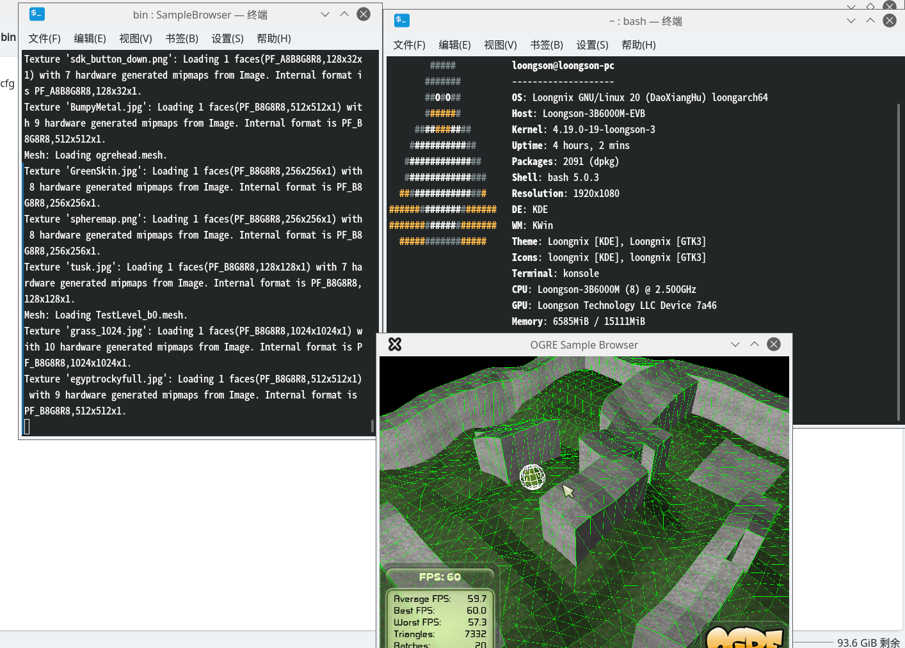

# OGRE LoongArch64 LSX Optimized

This is a LoongArch64-optimized version of OGRE (Object-Oriented Graphics Rendering Engine) with LSX SIMD extensions support for Loongson processors.

##  Overview

This fork provides optimized builds of OGRE specifically for Loongson 3B6000M processors, utilizing the LSX (Loongson SIMD Extension) instruction set for improved performance.

### Supported Processors
- **Loongson 3B6000M** (supports LSX)
- **Note**: LASX is not supported on 3B6000M and has been disabled

##  Quick Start

### Prerequisites

```bash
# Install build dependencies on Loongnix
sudo apt-get update
sudo apt-get install build-essential cmake libfreetype6-dev libx11-dev \
    libgl1-mesa-dev libglu1-mesa-dev libxrandr-dev libxaw7-dev \
    libzzip-dev libxaw7-dev libfreeimage-dev libboost-all-dev \
    libgles2-mesa-dev libgles3-mesa-dev
```

### Build Instructions

```bash
# Clone the repository
git clone https://github.com/liqidou/ogre-loongarch64-lsx.git
cd ogre-loongarch64-lsx

# Create build directory
mkdir build && cd build

# Configure with CMake
cmake .. \
    -DCMAKE_BUILD_TYPE=Release \
    -DOGRE_BUILD_SAMPLES=ON \
    -DOGRE_BUILD_TOOLS=ON \
    -DOGRE_BUILD_TESTS=OFF \
    -DOGRE_BUILD_RENDERSYSTEM_GL=ON \
    -DOGRE_BUILD_RENDERSYSTEM_GL3PLUS=ON \
    -DOGRE_BUILD_RENDERSYSTEM_GLES2=ON \
    -DOGRE_BUILD_RENDERSYSTEM_VULKAN=OFF \
    -DOGRE_ENABLE_PRECOMPILED_HEADERS=OFF \
    -DOGRE_BUILD_PLUGIN_GLSLANG=OFF

# Build (use -j$(nproc) for parallel build)
make -j$(nproc)
```

### Running Examples

```bash
# Set library path
export LD_LIBRARY_PATH=/path/to/ogre-loongarch64-lsx/build/lib:$LD_LIBRARY_PATH

# Run the sample browser
cd /path/to/ogre-loongarch64-lsx/build/bin
./SampleBrowser
```

##  Optimizations

### LSX SIMD Extensions
- **Enabled**: `-mlsx` compiler flag
- **Benefit**: Improved vector operations performance
- **Compatibility**: Loongson 3B6000 series and newer

### Architecture Optimizations
- **Base Architecture**: `-march=loongarch64`
- **Target**: LoongArch 64-bit instruction set
- **Compatibility**: All LoongArch 64-bit processors

### Disabled Features
- **LASX**: Not supported on 3B6000 series
- **Vulkan**: Not available on current Loongnix setup

## 📊 Performance

The LSX optimizations provide significant performance improvements for:
- Vector mathematics operations
- Matrix transformations
- Texture processing
- Geometry calculations

##  Screenshots

### SampleBrowser Running on Loongson 3B6000M



*SampleBrowser successfully running with LSX optimizations on Loongson 3B6000M*

## 🛠️ Build Configuration

### CMake Options

| Option | Description | Default |
|--------|-------------|---------|
| `OGRE_BUILD_SAMPLES` | Build example applications | ON |
| `OGRE_BUILD_TOOLS` | Build utility tools | ON |
| `OGRE_BUILD_TESTS` | Build test suite | OFF |
| `OGRE_BUILD_RENDERSYSTEM_GL` | OpenGL 2.x support | ON |
| `OGRE_BUILD_RENDERSYSTEM_GL3PLUS` | OpenGL 3.x+ support | ON |
| `OGRE_BUILD_RENDERSYSTEM_GLES2` | OpenGL ES 2.x/3.x support | ON |
| `OGRE_BUILD_RENDERSYSTEM_VULKAN` | Vulkan support | OFF |

### Compiler Flags

The build automatically detects and applies the following optimizations:

```bash
-march=loongarch64  # Base LoongArch 64-bit architecture
-mlsx               # LSX SIMD extensions (if supported)
```

##  Troubleshooting

### Common Issues

1. **"Illegal instruction" errors**
   - Ensure you're running on a supported Loongson processor
   - Verify LSX support with `cat /proc/cpuinfo | grep lsx`

2. **Missing dependencies**
   - Install all required packages listed in Prerequisites
   - Check library paths if linking fails

3. **OpenGL context creation failures**
   - Ensure proper graphics drivers are installed
   - Check X11 and Mesa libraries

### CPU Feature Detection

To verify your processor supports the required features:

```bash
# Check for LSX support
cat /proc/cpuinfo | grep lsx

# Check for LASX support (not needed for 3B6000)
cat /proc/cpuinfo | grep lasx

# Full feature list
cat /proc/cpuinfo | grep features
```

##  Contributing

1. Fork the repository
2. Create a feature branch
3. Make your changes
4. Test on LoongArch hardware
5. Submit a pull request

##  License

This project inherits the license from the original OGRE project.
See [LICENSE](LICENSE) for details.

##  Contact

For issues specific to this LoongArch64 LSX-optimized fork, please open an issue on GitHub.

---

**Note**: This is a community-maintained fork optimized for LoongArch64 architecture. For general OGRE support, please refer to the [official OGRE repository](https://github.com/OGRECave/ogre).